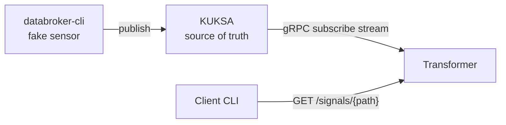
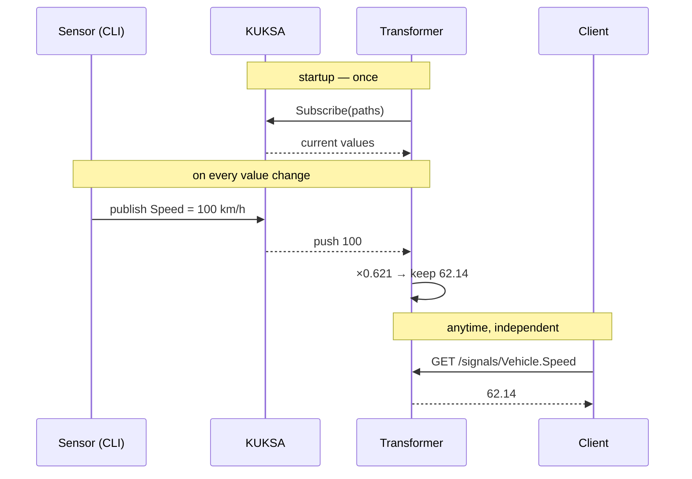

# VSS Signal Bridge — Design & PoC

## 1. Goal

Build two programs:

- **VssDataTransformer** — subscribes to VSS paths on KUKSA, converts values (km/h → mph), serves them over an API.
- **VssDataClient** — CLI that asks the transformer for a path's value and prints it.

## 2. Architecture



Data flows one way. The client never talks to KUKSA. The transformer never writes to KUKSA.

## 3. Transformer internals — 4 small parts

| Part | Does what |
|---|---|
| **Config** | YAML file: which paths, which transform each. Nothing hardcoded. |
| **Subscriber** | Background task holding the gRPC stream. Reconnects with backoff. |
| **Transforms** | Pure functions: value in → value out. Easy to unit-test. |
| **Cache + API** | Map of path → latest value. API reads from it. |

The API layer knows nothing about KUKSA. That's what lets us add gRPC later without touching anything else.

## 3b. How data moves — sequence



- **Left side = push, gRPC :55555.** KUKSA sends on every change; the transformer never polls.
- **Right side = pull, HTTP :8080.** The client asks when it wants; answered from memory, KUKSA not involved.
- **The transformer dials out once, then listens** — like a phone call. One stream, no matter how many clients.

## 4. Design decisions

- **REST first, gRPC as bonus.** REST = working end-to-end fastest, demoable with curl.
- **Config-driven.** Adding a signal = one line of YAML.
- **No persistence.** KUKSA holds the truth. Crash recovery = just re-subscribe.
- **Serve stale data, with timestamp.** If the stream drops: keep serving the last value, retry in background.

## 5. Contracts

**Config:**

```yaml
kuksa:
  address: "http://127.0.0.1:55555"
server:
  listen: "0.0.0.0:8080"
subscriptions:
  - path: Vehicle.Speed
    transform: kmh_to_mph      # × 0.621371
  - path: Vehicle.Cabin.Door.Row1.Left.IsOpen
    transform: passthrough
```

**REST:** `GET /signals/Vehicle.Speed` →

```json
{ "path": "Vehicle.Speed", "value": 62.14, "updated_at": "2026-08-18T10:15:04Z" }
```

- `404` — path not configured.
- `503` — no value received yet.

**Client:** `vss-client --addr http://localhost:8080 --path Vehicle.Speed` → prints `62.14`

## 6. Failure handling

| What breaks | What happens |
|---|---|
| KUKSA down at startup | Retry with backoff. API returns 503 until first value. |
| Stream drops mid-run | Auto-resubscribe. Cache keeps serving last value. |
| Transformer restarts | Stateless: re-read config, re-subscribe. Done. |
| Unknown path queried | 404. |

## 7. PoC — done ✔

**Why:** the only risky part is KUKSA's subscribe. Prove it with zero code, before implementing.

**What we did:**

1. Ran KUKSA in Docker (port 55555).
2. Terminal A: `databroker-cli` → `subscribe Vehicle.Speed` — plays the transformer.
3. Terminal B: `databroker-cli` → `publish Vehicle.Speed 72.5` — plays the sensor.
4. The value appeared in Terminal A **instantly, by itself**. Pushed, not polled.

**Result:** the exact stream the transformer will consume (`kuksa.val.v1`) — proven working.

**What we learned (and how it changed the design):**

- On subscribe, the broker sends the **current value immediately**.
  → Crash recovery is free: re-subscribe = cache warmed. No initial Get needed.
- The publish verb is `publish` (not `set`). `actuate` is separate, for actuators.
- Old updates are **not replayed** — only current value + new changes. Fine: we only cache the latest.
- `host.docker.internal` was container-only. The real transformer uses `127.0.0.1:55555`.

## 8. Implementation plan (2–3 h)

| # | Step | Why this order |
|---|---|---|
| 1 | ~~KUKSA in Docker + PoC~~ ✔ | Environment proven |
| 2 | Skeleton: subscribe + print updates | Hard part first |
| 3 | Transforms + cache | Core logic |
| 4 | REST endpoint + client CLI | End-to-end |
| 5 | README | Deliverable |
| 6 | Bonuses: GitHub+CI, then gRPC API | If time allows |

**Stack (Rust):** tokio (async) · tonic (gRPC) · axum (REST) · serde_yaml (config) · clap (CLI).
