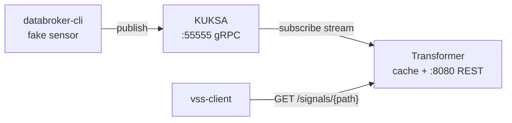

# VSS Signal Bridge

Two programs bridging the KUKSA Databroker to plain HTTP clients:

- **VssDataTransformer** — subscribes to configured VSS paths on KUKSA (gRPC `kuksa.val.v1`),
  transforms incoming values (e.g. km/h → mph), caches the latest result per path,
  and serves it over a REST API.
- **VssDataClient** (`vss-client`) — CLI that queries the transformer for a path and prints the value.

## Architecture



Data flows one way. The transformer dials KUKSA once and listens (push);
clients pull from the transformer's in-memory cache — no KUKSA round-trip per query.

Internals (one small module each): `config` (YAML: path → transform) →
`subscriber` (gRPC stream + reconnect backoff) → `transforms` (pure functions) →
`cache` (RwLock map) → `api` (axum REST). The API layer knows nothing about KUKSA,
so a gRPC endpoint can be added beside it without touching the rest.

## How to run

Everything runs in Docker (no local Rust needed).

**1. Start KUKSA:**

```
docker run -d --rm --name databroker -p 55555:55555 ghcr.io/eclipse-kuksa/kuksa-databroker:main --insecure
```

**2. Start the transformer:**

```
docker run -d --rm --name vss-transformer -p 8080:8080 \
  -e KUKSA_ADDRESS=http://host.docker.internal:55555 \
  -v "<repo>:/app" -v vss-cargo-registry:/usr/local/cargo/registry -v vss-target:/app/target \
  -w /app rust:1 cargo run -p transformer
```

**3. Publish a test value** (KUKSA's own CLI; note the verb is `publish`):

```
docker run -it --rm ghcr.io/eclipse-kuksa/kuksa-databroker-cli:main --server http://host.docker.internal:55555
> publish Vehicle.Speed 100
```

**4. Query it:**

```
# REST directly:
curl http://localhost:8080/signals/Vehicle.Speed
# → {"path":"Vehicle.Speed","value":62.1371,"transform":"kmh_to_mph","updated_at":"..."}

# or via the client CLI:
docker run --rm -v "<repo>:/app" -v vss-cargo-registry:/usr/local/cargo/registry \
  -v vss-target:/app/target -w /app rust:1 \
  cargo run -q -p client -- --addr http://host.docker.internal:8080 --path Vehicle.Speed
# → 62.1371
```

**Watching it work** — the transformer logs every update as it flows through the pipeline:

```
docker logs -f vss-transformer
```

```
Subscribed to 3 paths: ["Vehicle.Speed", ...]
Vehicle.Speed: Float(100.0) -[kmh_to_mph]-> Float(62.1371)
Vehicle.Cabin.Door.Row1.DriverSide.IsOpen: Bool(true) -[passthrough]-> Bool(true)
```

Each line shows: raw value received from KUKSA → which transform was applied → the
cached result. (`docker logs -f databroker` shows the broker side.)

**Tests:** `cargo test -p transformer` (transform functions are pure — unit tested).

## API

| Route | Result |
|---|---|
| `GET /signals/{path}` | `200` JSON `{path, value, transform, updated_at}` |
| | `404` — path not in the configured subscription set |
| | `503` — subscribed, but no value received yet |
| `GET /signals` | all cached signals |

Configuration (`config.yaml`): KUKSA address (overridable via `KUKSA_ADDRESS` env),
listen address, and the path → transform list. Adding a signal is one YAML line.

## Design decisions

- **Cache, not proxy.** Subscribing is required anyway, so keeping the latest value is free.
  Queries answer from memory; 1000 clients still cost one KUKSA stream; last known value
  keeps serving through broker outages (with its `updated_at` timestamp for staleness).
- **REST first, gRPC as bonus.** Fastest to a demoable end-to-end; the decoupled API layer
  leaves room for a gRPC server next to it.
- **Stateless crash recovery.** KUKSA is the source of truth. Verified during the PoC:
  the broker delivers each path's *current value* immediately on subscribe, so a restarted
  transformer re-warms its cache just by resubscribing — no persistence needed.
- **Reconnect with exponential backoff** (1s → 30s cap) when the stream drops; the cache
  keeps serving meanwhile.

## Notes found during implementation

- The assignment's example path `Vehicle.Cabin.Door.Row1.Left.IsOpen` no longer exists in
  VSS 6.0 (shipped with current databroker) — renamed to `...Row1.DriverSide.IsOpen`
  (VSS 4.0 change). Caught by the subscribe error, fixed in `config.yaml`.
- KUKSA proto files are vendored under `transformer/proto/` and compiled at build time
  (`tonic-build` + vendored `protoc`) — the build has no system protoc dependency.
- `--insecure` is for this local exercise only; production would use TLS + KUKSA's JWT
  token authorization.
